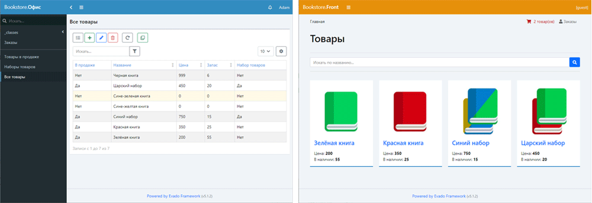

# Веб-приложение «Книжный магазин» 

- Статья [Как создать товар состоящий из других товаров](https://zen.yandex.ru/media/id/60645976a736eb1c45830da8/kak-sozdat-tovar-sostoiascii-iz-drugih-tovarov-61dccf2e577bb77d26c81e85)
- Статья [Как создать товар с произвольным набором свойств](https://zen.yandex.ru/media/id/60645976a736eb1c45830da8/kak-sozdat-tovar-s-dopolnitelnymi-svoistvami-61df824037100e0fd8009c42)

Веб-приложение сделано с помощью 
[декларативного фреймворка Evado](https://github.com/mkhorin/evado).



## Установка через Docker

Скопируйте приложение в `/app`
```sh
cd /app
docker-compose up -d mongo
docker-compose up --build installer
docker-compose up -d server
```

## Типовая установка

#### Установите окружение
- [Node.js](https://nodejs.org) (версия 16)
- [MongoDB](https://www.mongodb.com/download-center/community) (версия 4)

#### Linux
Скопируйте приложение в `/app`
```sh
cd /app
npm install
NODE_ENV=development node console/install
NODE_ENV=development node console/start
```

#### Windows
Скопируйте приложение в `c:/app`
```sh
cd c:/app
npm install
set NODE_ENV=development
node console/install
node console/start
```

## Использование

Веб-интерфейс `http://localhost:3000`

Войти как администратор:
```sh
Email: a@a.a
Password: 123456
```