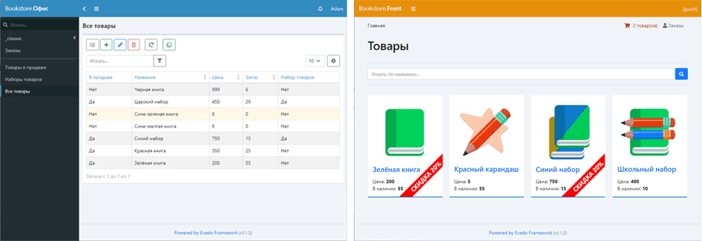

# Веб-приложение «Книжный магазин»

- Статья [Составные товары](https://zen.yandex.ru/media/id/60645976a736eb1c45830da8/kak-sozdat-tovar-sostoiascii-iz-drugih-tovarov-61dccf2e577bb77d26c81e85)
- Статья [Товары с произвольным набором свойств](https://zen.yandex.ru/media/id/60645976a736eb1c45830da8/kak-sozdat-tovar-s-dopolnitelnymi-svoistvami-61df824037100e0fd8009c42)
- Статья [Универсальная система скидок](https://zen.yandex.ru/media/id/60645976a736eb1c45830da8/universalnye-skidki-dlia-tovarov-i-zakazov-61ee412b0fdc8f33eae2695c)
- Статья [Категоризуйся на раз-два](https://zen.yandex.ru/media/id/60645976a736eb1c45830da8/kategorizuisia-na-razdva-6205c1c0047813262a2ee9b8)
- Статья [Поиск всему голова](https://zen.yandex.ru/media/id/60645976a736eb1c45830da8/poisk-vsemu-golova-6212e8dd2216c21a91524bba)
- Статья [Динамическое меню из категорий](https://zen.yandex.ru/media/id/60645976a736eb1c45830da8/gotovim-dinamicheskoe-meniu-iz-kategorii-62380391b834125366988617)

Веб-приложение сделано с помощью
[декларативного фреймворка Evado](https://github.com/mkhorin/evado).



## Установка через Docker

Скопируйте приложение в `/app`
```sh
cd /app
docker-compose up -d mongo
docker-compose up --build installer
docker-compose up -d server
```

## Типовая установка

#### Установите окружение
- [Node.js](https://nodejs.org) (версия 20)
- [MongoDB](https://www.mongodb.com/download-center/community) (версия 5)

#### Linux
Скопируйте приложение в `/app`
```sh
cd /app
npm install
NODE_ENV=development node console/install
NODE_ENV=development node console/start
```

#### Windows
Скопируйте приложение в `c:/app`
```sh
cd c:/app
npm install
set NODE_ENV=development
node console/install
node console/start
```

## Использование

Веб-интерфейс `http://localhost:3000`

Войти как администратор:
```sh
Email: a@a.a
Password: 123456
```